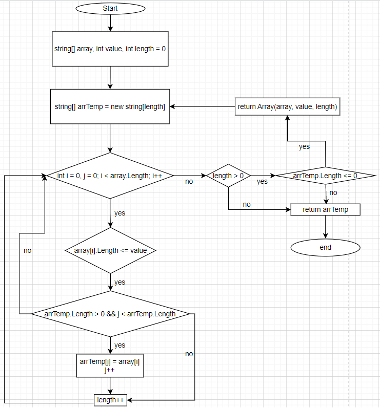

# Описание работы программы

Задача: 
*Написать программу, которая из имеющегося массива строк формирует массив из строк, длина которых меньше, либо равна 3 символа. Первоначальный массив можно ввести с клавиатуры, либо задать на старте выполнения алгоритма. При решении не рекомендуется пользоваться коллекциями, лучше обойтись исключительно массивами.*

## Блок-схема программы

Метод принимает 3 аргумента
- массив типа string
- длину элемента типа int
- не обязательный аргумент - длина возвращаемого массива типа int

1. Метод перебирает полученный массив и проверяет сколько подходящих элементов
2. Если подходяших элементов нет, то метод возврашает пустой массив
3. Если подходяших элементов больше 0 и длина временного массива меньше 0, то метод вызывается рекурсивно с аргументами

- массив
- длину элемента
- длину возврашаемого массива

4. Метод перебирает полученный массив и проверяет, подходит ли элемент по условию. Если подходит, то записывает элемент во временный массив и возврашает временный массив. Если подходяших элементов больше 0 и длина временного массива больше 0, то метод возврашает временный массив.